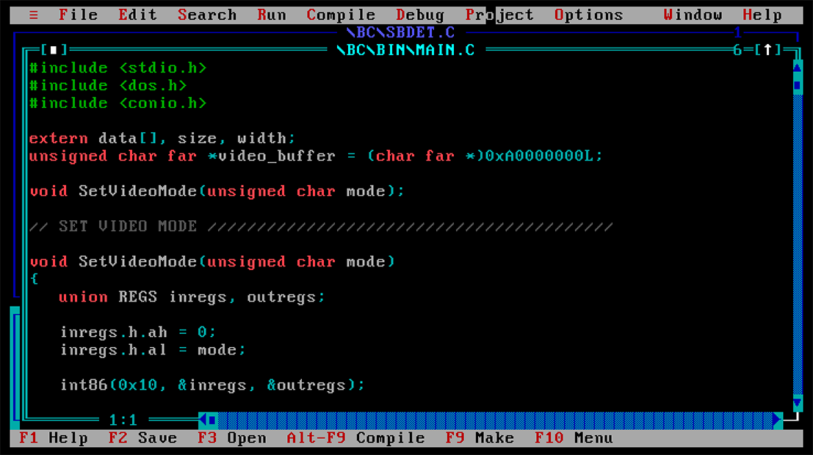
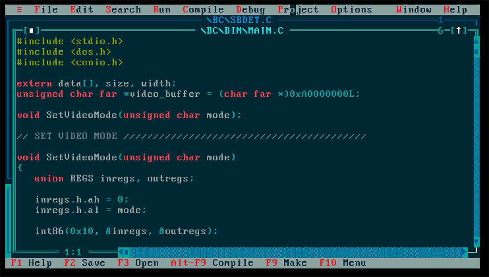

# MS-DOS Solarized Theme

Resident Solarized theme for MS-DOS. Changes default palette and stays resident to restore palette during video mode changes. Originally based on old TSR skeleton code for loading high into umb if exists etc. Loads/unloads safely. ye olde code - Dark Fiber [NuKE]

Converted to yasm

## Screenshots
Before

After



## Build

Build by yasm

```bash
  ./make.sh
```
  or
```bash
 yasm -a x86 -f bin -o solarize.com solarize.s
 yasm -a x86 -f bin -o test.com test.s
```

## Usage/Examples
Just run it and it will stay resident
```bash
C:\> solarize <ENTER>
```
To unload just run it again

